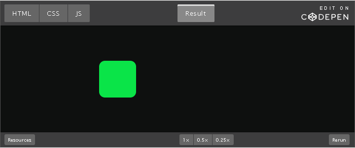
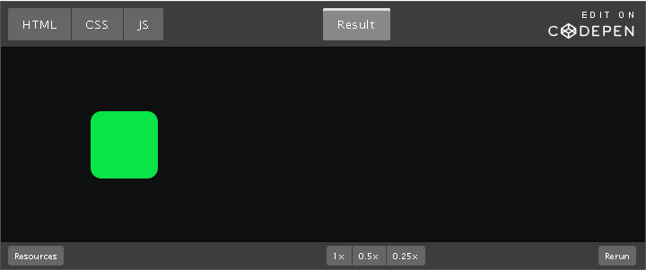
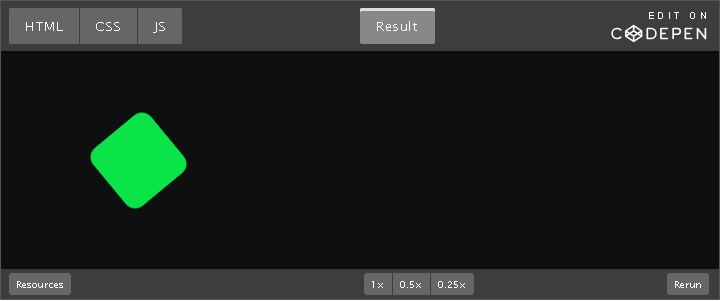
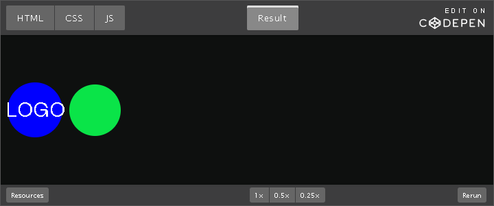
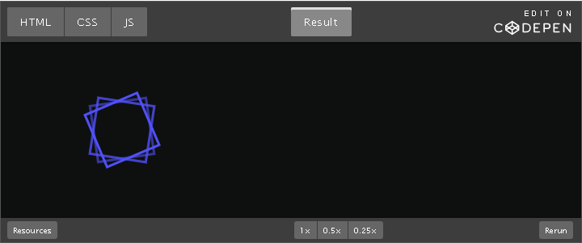

Landing pages often have moving pictures to make them more interesting.
But making these movements with just HTML and CSS can be hard, so we use
special JavaScript libraries for animation.

For our <a href="https://marmelab.com/ra-enterprise/">react-admin</a> product&apos;s
landing page, we chose to use <b>GSAP</b>. We learned a lot about both the
GSAP library and animations in general during this process, and we also
encountered some tricky parts.

So, we decided to share what we learned in a series of articles:

<ol>
  <li>GSAP Basics: Dive Into Web Animations <b>(this post)</b>.</li>
  <li><a href="https://marmelab.com/blog/2024/04/11/trigger-animations-on-scroll-with-gsap-scrolltrigger.html">
    Trigger Animations On Scroll With GSAP<a/>.</li>
  <li><a href="https://marmelab.com/blog/2024/05/30/gsap-in-practice-avoid-the-pitfalls.html">
    GSAP in practice: some pitfalls to avoid</a>.</li>
</ol>

Let&apos;s get started with a quick overview of GSAP.

<h3>What is GSAP?</h3>

<a href="https://gsap.com/">GSAP</a> (for GreenSock Animation Platform) is a
JavaScript library that allows to animate elements in a webpage. It
makes it possible to create complex and performant animations, while yet
offering a very friendly and versatile API.

It also comes with a variety of plugins, some of which are paid,
offering powerful and customizable tools to help animate almost
anything, from text to SVG, and even include some effects based on
physics.

Just have a look at their <a href="https://gsap.com/">homepage</a> to get a glimpse
of what this library can do, it&apos;s amazing!

Now that you are, hopefully, hyped up just like I am, let&apos;s dive in!

<h3>Main Concepts</h3>

In this section, I&apos;ll cover two of the most basic concepts introduced
by the library.

<h3>Tween</h3>

Probably the first concept you will come across when reading the GSAP
docs are <b>tweens</b>. The term tween comes from the word <i>between</i>, as a
tween is an object describing an animation <i>between</i> a <b>from</b> state
and a <b>to</b> state. It also holds the <b>target</b> (the object to
animate), and any other properties describing the animation, like its
duration, or the easing function used to calculate mid-animation values.

<h3>Timeline</h3>

Basically, the <b>timeline</b> answers the following question: how can I
trigger my animations in sequence, or relative to one another, without
having to calculate all the <i>delays</i> myself? The solution is to use a
timeline to group the tweens together, optionally specifying where the
tweens should be placed in the timeline with the position parameter. The
timeline can then be manipulated (play, pause, seek a specific frame,
&hellip;) as a whole without having to manage the playhead for all tweens
manually.

<h4>PLAYHEAD</h4>

<pre>
&vert;&dash;&dash;&dash;&dash;&dash;&dash;&dash;&dash;&dash;&dash;&dash;&dash;&dash;-timeline&dash;&dash;&dash;&dash;-&vert;&dash;&dash;&dash;&dash;&dash;&dash;&dash;&dash;&dash;&dash;-&vert;
&vert;&dash;-tween1&dash;-&vert;&dash;&dash;&dash;&dash;-tween2&dash;&dash;&dash;&dash;-&vert;&dash;&dash;&dash;&dash;&dash;&dash;&dash;&dash;&dash;&dash;-&vert;
</pre>

<h4>Syntax</h4>

In this section, I will go through some of the code syntaxes that I
found most useful. But be sure to check out the <a href="https://gsap.com/resources/get-started">GSAP
docs</a> for more features and detailed examples.

<h4>gsap.to()</h4>

To create a tween, it can be as simple as:

<pre>gsap.to(&quot;.box&quot;, { x: 100 });</pre>

This tells GSAP to create a tween, <b>targeting</b> DOM elements matching
the CSS selector &quot;.box&quot;. The elements will be animated <b>from</b> their
current state (hence their current position in our example), <b>to</b> the
state { x: 100 }.

<b>Tip:</b> x is a <a href="https://gsap.com/resources/get-started/#transform-shorthand">
transform shorthand</a> provided by GSAP, equivalent to transform: translateX(100px).

<!--~~~~~~~~~~~~~~~~~~~~~~~~~~~~~~~~~~~~~~~~~~~~~~~~~~~~~~~~~~~~~~~~~~~~~~~~~~~~~~~~~~~~~~~~~~~~-->
<!--~~~~~~~~~~~~~~~~~~ 01. green square w/rounded corners, move left to right ~~~~~~~~~~~~~~~~~~-->

<!-- (./images/image001.png){width="6.5in" height="2.7263888888888888in"} -->
<!-- https://codepen.io/slax57/pen/vYMBPGV  -->

We did not provide a duration, so by default the animation will take 0.5
seconds.

This can be easily changed using the duration <a href="https://gsap.com/resources/get-started#special-properties">
special property</a>:

<pre>gsap.to(&quot;.box&quot;, { x: 100, duration: 2 });</pre>

Also, our animation will run immediately, as soon as the page&apos;s
JavaScript is loaded. We can change that using the delay property:

<pre>gsap.to(&quot;.box&quot;, { x: 100, duration: 2, delay: 1 });</pre>

We can also change the &quot;feel&quot; of the animation by changing
the ease function. By default, the tween will use
the &quot;power1.out&quot; function. There are plenty to choose from, and GSAP
even offers a <a href="https://gsap.com/docs/v3/Eases/">tool</a> to better
visualize them. To make the animation a little more fun, we can for
instance use the &quot;elastic&quot; ease function:

<pre>gsap.to(&quot;.box&quot;, { x: 100, duration: 2, delay: 1, ease: &quot;elastic&quot; });</pre>
<!--~~~~~~~~~~~~~~~~~~~~~~~~~~~~~~~~~~~~~~~~~~~~~~~~~~~~~~~~~~~~~~~~~~~~~~~~~~~~~~~~~~~~~~~~~~~~-->
<!--~~~~~~~~~~~~~~ 02. green square/rounded corners elastic bounce left to right ~~~~~~~~~~~~~~~-->

<!-- (./images/image002.png){width="6.5in" height="2.717361111111111in"} -->
<!-- https://codepen.io/slax57/pen/KKYPEgV  -->

<h4>gsap.from()</h4>

The <b>gsap.to()</b> function has a twin (not to be confused with tween! 😁️)
function: <b>gsap.from()</b>. It works exactly the same way. The only
difference is that, instead of animating from the element&apos;s current
state <b>to</b> the specified state, it will do the opposite.

The following example will animate elements with CSS
class &quot;.box&quot; from x: -100 to x: 0.

<pre>gsap.from(&quot;.box&quot;, { x: -100 });</pre>

This can be very useful to create animations that run on page load, or
to make new elements appear.

Here is another example with some opacity change, to make the element fade in:

<pre>
gsap.from(&quot;.box&quot;, { x: -100, autoAlpha: 0 });
</pre>

<b>Tip:</b> <b>autoAlpha</b> is another <a href="https://gsap.com/resources/get-started/#transform-shorthand">
transform shorthand</a>), for both opacity and visibility.

<!--~~~~~~~~~~~~~~~~~~~~~~~~~~~~~~~~~~~~~~~~~~~~~~~~~~~~~~~~~~~~~~~~~~~~~~~~~~~~~~~~~~~~~~~~~~~~-->
<!--~~~~~~~~~~~~~~~~~~ 03. green square/rounded corners slide left to right ~~~~~~~~~~~~~~~~~~~~-->

<!-- (./images/image003.png){width="6.5in" height="2.717361111111111in"} -->
<!-- https://codepen.io/slax57/pen/qBwWvqo  -->

<h4>gsap.fromTo()</h4>

Now that we&apos;ve covered the <b>gsap.to()</b> and <b>gsap.from()</b> functions, you can
easily guess what the <b>gsap.fromTo()</b> function does. It can be useful in
certain cases to specify both a <b>from</b> and a <b>to</b> state, for
example, to apply a style as soon as the JavaScript is loaded, and
animate from it immediately after.

In the following example, if the animation is enabled, the element will
first have its opacity set to 0, and then will progressively reach an
opacity of 0.8. It the animation is disabled, the element will keep its
opacity of 1.

<pre>
if (shouldAnimate) {
  gsap.fromTo(&quot;.box&quot;, { opacity: 0 }, { opacity: 0.8 });
}
</pre>

<h4>gsap.set()</h4>

<b>gsap.set()</b> is the last function returning a <i>tween</i> that I&apos;d like to
cover. In essence, it&apos;s equivalent to calling <b>gsap.to()</b> with a duration
of 0: it allows to apply a state immediately to an element. This can be
useful to set a property only if a condition is met, or to set the state
from which we will be animating later.

<pre>
gsap.set(&quot;.box&quot;, { transformOrigin: &quot;center&quot; });
gsap.to(&quot;.box&quot;, { rotation: 360, repeat: -1, duration: 5, ease: &quot;linear&quot; });
</pre>

<b>Tip:</b> <a href="https://marmelab.com/blog/2024/03/27/infinitely">repeat: -1</a> makes an animation
repeat infinitely.

<!--~~~~~~~~~~~~~~~~~~~~~~~~~~~~~~~~~~~~~~~~~~~~~~~~~~~~~~~~~~~~~~~~~~~~~~~~~~~~~~~~~~~~~~~~~~~~-->
<!--~~~~~~~~~~~~~~~~~~~~ 04. green square/rounded corners rotate clockwise ~~~~~~~~~~~~~~~~~~~~~-->

<!-- (./images/image004.png){width="6.5in" height="2.717361111111111in"} -->
<!-- https://codepen.io/slax57/pen/ExJYMWw  -->

<h4>gsap.timeline()</h4>

As the name suggests, gsap.timeline() allows to create a <b>timeline</b>.

In the following example, the &quot;.circle&quot; element will start animate
right after the &quot;.logo&quot; completes its animation. This allows to run
the animations in sequence.

<pre>
const tl = gsap.timeline();
tl.from(&quot;.logo&quot;, { duration: 2.5, opacity: 0, scale: 0.3 }); // Instead of gsap.from()

tl.from(&quot;.circle&quot;, { duration: 1, opacity: 0, y: 150 }); // Instead of gsap.from()
</pre>
<!--~~~~~~~~~~~~~~~~~~~~~~~~~~~~~~~~~~~~~~~~~~~~~~~~~~~~~~~~~~~~~~~~~~~~~~~~~~~~~~~~~~~~~~~~~~~~-->
<!--~~~~~~~~ 05. blue logo, green circle, logo grow, green circle moves up so parallel ~~~~~~~~~-->

<a href="https://codepen.io/slax57/pen/BaEBbYa"

</a>

<!-- (./images/image005.png){width="6.5in" height="2.7083333333333335in"} -->
<!-- https://codepen.io/slax57/pen/BaEBbYa  -->

The main advantage of this syntax is that I can now change the duration
of the animation of &quot;.logo&quot;, and it will automatically keep the
animation of &quot;.circle&quot; in sync: it will always run as soon as
the &quot;.logo&quot; animation is complete.

Using a timeline also adds a new ability to
the to(), from(), fromTo() and set() functions: they now accept an
additional parameter, allowing to specify <i>where</i> in the timeline each
animation should be inserted.

<pre>
const tl = gsap.timeline();
tl.from(&quot;.logo&quot;, { duration: 2.5, opacity: 0, scale: 0.3 });

tl.from(&quot;.circle&quot;, { duration: 1, opacity: 0, y: 150 }, &quot;+=2&quot;); //
</pre>

Starts this animation 2 seconds past the end of the timeline (creates a gap).

<!--~~~~~~~~~~~~~~~~~~~~~~~~~~~~~~~~~~~~~~~~~~~~~~~~~~~~~~~~~~~~~~~~~~~~~~~~~~~~~~~~~~~~~~~~~~~~-->
<!--~~~~~~~~ 06. blue logo, green circle, logo grow, green circle moves up so parallel ~~~~~~~~~-->

<!-- ./images/image006.png){width="6.5in" height="2.6993055555555556in"} -->
<!-- https://codepen.io/slax57/pen/YzMKMGz  -->

This extra parameter is called the <a href="https://gsap.com/docs/v3/GSAP/Timeline#positioning-animations-in-a-timeline">position parameter</a>,
and accepts many syntaxes to accommodate for all use cases:

<ul>
  <li>3 insert at exactly 3 seconds from the start of the timeline</li>
  <li>&quot;&lt;&quot; insert at the <i>start</i> of the previous animation</li>
  <li>&quot;&gt;&quot; insert at the <i>end</i> of the previous animation</li>
  <li>&quot;&lt;+=3&quot; 3 seconds past the start of the previous animation</li>
  <li>&quot;&gt;-0.5&quot; 0.5 seconds before the end of the previous animation</li>
  <li>&quot;-=25%&quot; overlap with the end of the timeline by 25% of the
    inserting animation&apos;s total duration</li>
  <li>and so on&hellip;</li>
</ul>

This makes it so much easier to decompose a complex animation into small
steps and experiment with the timing of each step independently.

<b>Tip:</b> Timelines can also be nested.

<h4>gsap.utils.toArray()</h4>

This utility method allows to get an array of elements matching a selector.

It can be useful to:

<ul>
  <li>Know how many elements there are (for calculations)</li>
  <li>Attach an animation to the specific element in the array rather than
    to all elements (useful to select the current element as a trigger
    for instance)</li>
</ul>

In the following example, we use this feature to set a different initial
rotation angle for each rectangle, and also a different duration,
resulting in different rotation speeds:

<pre>
const svgRectangles = gsap.utils.toArray(&apos;#my-svg rect&apos;);
svgRectangles.forEach((rect, i) =&gt; {
  gsap.set(rect, {
    rotation: i &ast; 15,
    transformOrigin: &apos;50% 50%&apos;,
  });
  gsap.to(rect, {
    rotation: 360 + i &ast; 15,
    duration: 100 - i &ast; 20,
    repeat: -1,
    ease: &apos;linear&apos;,
  });
});
</pre>
<!--~~~~~~~~~~~~~~~~~~~~~~~~~~~~~~~~~~~~~~~~~~~~~~~~~~~~~~~~~~~~~~~~~~~~~~~~~~~~~~~~~~~~~~~~~~~~-->
<!--~~~~~~~~~~~~~~~~ 07. blue squares (3) rotate clockwise at differing speeds ~~~~~~~~~~~~~~~~~-->

<!-- ./images/image007.png){width="6.5in" height="2.717361111111111in"} -->
<!-- https://codepen.io/slax57/pen/OJGLGmb  -->

<h3>Conclusion</h3>

This covers some of the basics of GSAP. With this knowledge, you should
already have enough to start creating your own animations.

I&apos;m overall pretty impressed with GSAP. In particular, I like its API,
which is very versatile, allowing for a very synthetic syntax for the
most common use cases, while yet allowing for advanced customization for
the most complex ones.

In the next post of this series, we will push complexity a little
further, by creating animations that trigger on page scroll.

